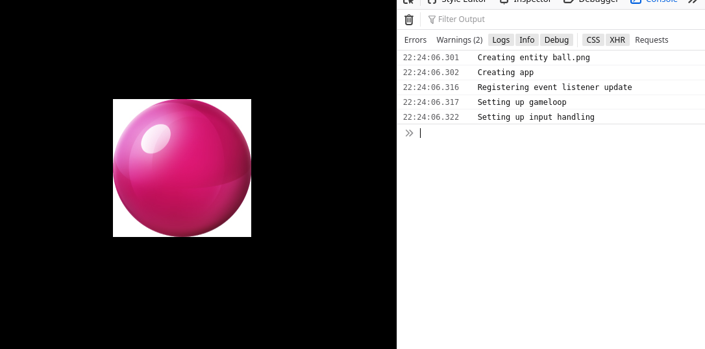

> this is a work in progress

2d game enging created for laymans


create a ball that you can move with arrow keys in a few lines of code
```js
const ball = createEntity("ball.png")

game.update = dt =>{
	ball.x += getArrowX()*dt*5
	ball.y += getArrowY()*dt*5
}
```


